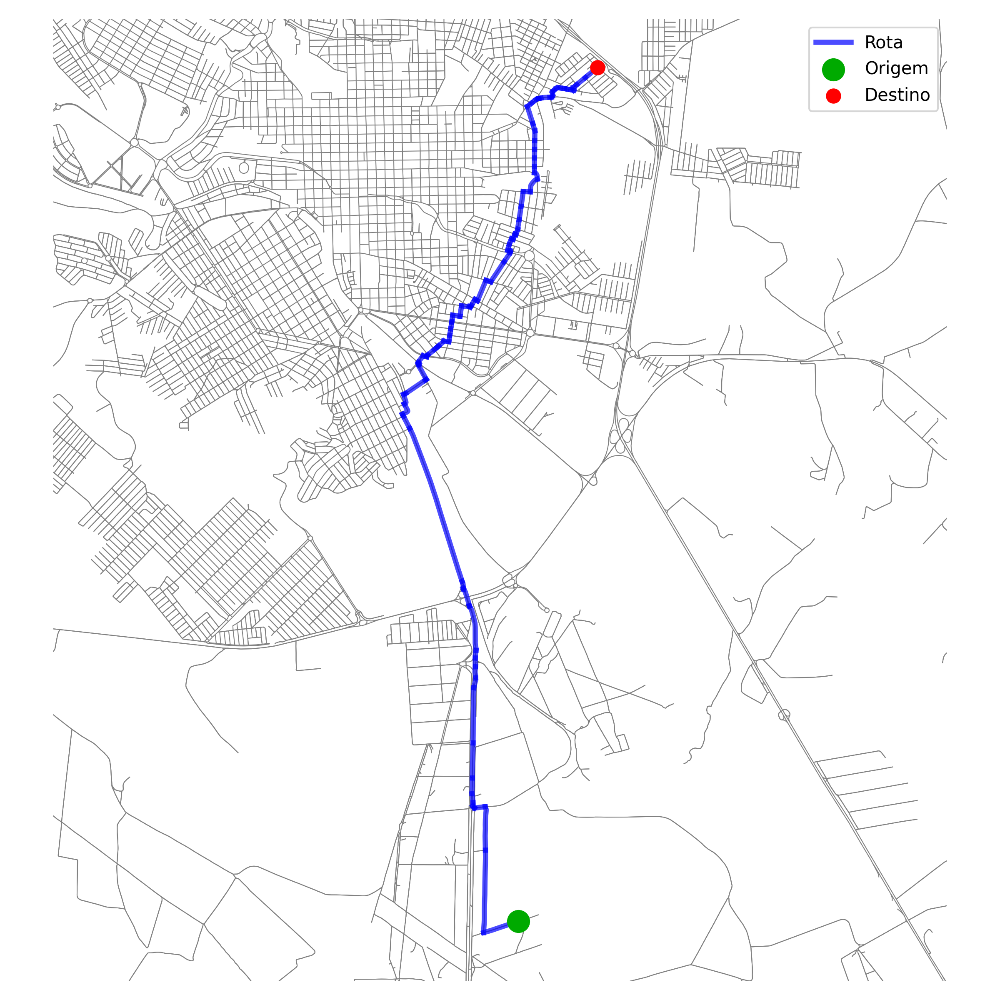

# IA - Busca de Doadores Compatíveis de Sangue 
Repositório referente ao trabalho 1 da disciplina **SCC0630 - Inteligência Artificial**. Toda a explicação da lógica do sistema encontra-se no Jupyter Notebook, enquanto o script `project.py` encapsula as funcionalidades em um único programa.

**Docente:** Profa. Dra. Solange Oliveira Rezende

**Alunos:**
- Leonardo Gueno Rissetto (13676482)
- Lucas Lima Romero (13676325)
- Luciano Gonçalves Lopes Filho (13676520)
- Marco Antonio Gaspar Garcia (11833581)
- Thiago Kashivagui Gonçalves (13676579)

## ✍️ Autores
|  [<br><sub>Leonardo Rissetto</sub>](https://github.com/LeoRissetto)  |  [<br><sub>Lucas Romero</sub>](https://github.com/lucaslimaromero)  |  [<br><sub>Luciano Lopes</sub>](https://github.com/lopesluciano) |
| :---: | :---: | :---: |

| [<br><sub>Marco Garcia</sub>](https://github.com/marcogarcia2) | [<br><sub>Thiago Gonçalves</sub>](https://github.com/thiagokg314) |
| :---: | :---: |

## 🩸 Visão Geral do Projeto
Este projeto implementa um protótipo de sistema para **localizar unidades de sangue compatível** disponíveis para doação em uma cidade. A ideia central é permitir que o usuário informe seu tipo sanguíneo e, a partir disso, o sistema identifique o hemocentro mais próximo que tenha estoque suficiente de um tipo sanguíneo compatível para atendimento, traçando a rota ideal até o local.

O sistema funciona da seguinte maneira:
- Um **grafo da cidade** do usuário é gerado na memória do programa;
- O sistema sabe o **tipo sanguíneo** do usuário e calcula quais são os doadores possíveis;
- De todos os hemocentros da cidade, **filtra** por aqueles que possuem estoque de sangue compatível;
- **Traça a rota** ideal até esse hemocentro.

No caso, a cidade escolhida foi **São Carlos - SP**. O sistema realiza dois tipos de buscas diferentes, a Busca Não Informada (Breadth-First Search) e a Busca Informada (A-star). Mais detalhes das implementações dessas buscas estão no notebook do repositório. 

A rota baseada no método de busca é traçada, e pode ser visualizada pelo usuário. Uma análise dos algoritmos de buscas foi feita no notebook em questão, e nela justificamos o porquê do algoritmo **A*** ser o mais adequado para o problema. 

<p align="center">
  
</p>
<p align="center">
  <a style="font-size: 12px; text-decoration: none; color: inherit;">
    Rota traçada pelo sistema para Hemocentro válido.
  </a>
</p>

## 📚 Instalando as Dependências
Para executar o ambiente Python, crie um ambiente isolado para instalar as dependências necessárias. Essa é uma boa prática de programação, pois as bibliotecas ficam instaladas somente no ambiente e não no seu computador, garantindo isolamento e reproducibilidade.

Execute o seguinte comando para criar e ativar o ambiente Python:
```shell
python3 -m venv ai_env
source ai_env/bin/activate
```

Com o ambiente ativado, instale as dependências necessárias com o seguinte comando:
```shell
pip3 install -r data/requirements.txt
```

Pronto, as bibliotecas foram instaladas diretamente no ambiente criado. Para sair do ambiente, execute:
```shell
deactivate
```

## ⚙️ Executando o projeto
Para rodar o projeto, execute:
```shell
python3 src/project.py
```


